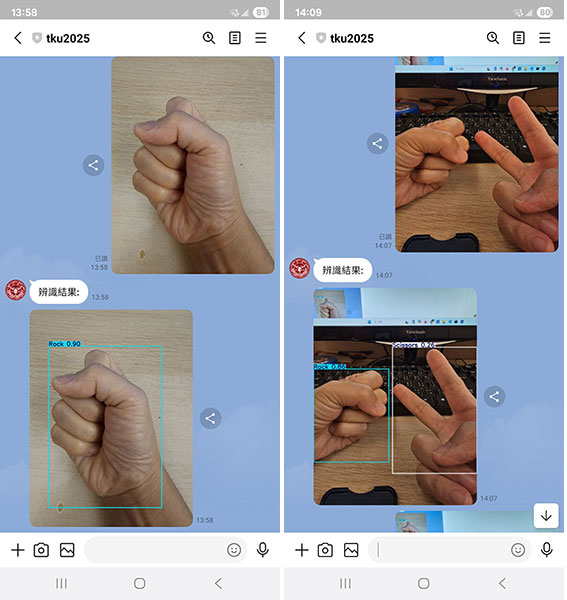

https://learn.microsoft.com/en-us/cpp/windows/latest-supported-vc-redist?view=msvc-170  

from mediapipe.python._framework_bindings import model_ckpt_util
ImportError: DLL load failed while importing _framework_bindings: 動態連結程式庫 (DLL) 初始化例行程序失敗。

1dataset->https://universe.roboflow.com/hiraki/rock-paper-scissors-rbzgd/dataset/2  
2dataset->https://universe.roboflow.com/xiao-chen-gypet/yahoooooo  

  

-虛擬環境安裝-  
  
1->環境變數  
C:\Users\XX\AppData\Local\Programs\Python\Python312\Scripts  
C:\Users\XX\AppData\Local\Programs\Python\Python312  
  
2->安裝virtualenv  
pip install virtualenv  
virtualenv (取一個名稱)  
  
3->啟動  
到虛擬環境Scripts目錄中啟動  
activate  

------------------------------------------------------------------------------  

-安裝模組-  
ModuleNotFoundError: No module named 'cv2'  
pip install opencv-python  

ModuleNotFoundError: No module named 'mediapipe'  
pip install mediapipe  
(myenv313) D:\Tamkang_University\02>pip install mediapipe
ERROR: Could not find a version that satisfies the requirement mediapipe (from versions: none)
ERROR: No matching distribution found for mediapipe

------------------------------------------------------------------------------  

-相關-  
virtualenv->virtualenv -p python3.12 XXX  
opencv cascade-files->https://github.com/opencv/opencv/tree/4.x/data  
https://teachablemachine.withgoogle.com/  
mediapipe->https://ai.google.dev/edge/mediapipe/solutions/guide?hl=zh-tw  
https://github.com/google-ai-edge/mediapipe-samples/tree/main/examples  
https://mediapipe.readthedocs.io/en/latest/solutions/hands.html  
universe->https://universe.roboflow.com/  
ultralytics->https://docs.ultralytics.com/zh  
flask->https://flask.palletsprojects.com/en/3.0.x/  
fastapi->https://fastapi.tiangolo.com/  
STEAM 教育學習網-> https://steam.oxxostudio.tw/category/python/ai/opencv-inrange.html  
影片播放軟體->https://potplayer.daum.net/  
影片下載->https://drive.google.com/file/d/1Jq0Kstm5Md6kr_XQr1NMVffFq5rTt_iu/view?usp=sharing  

